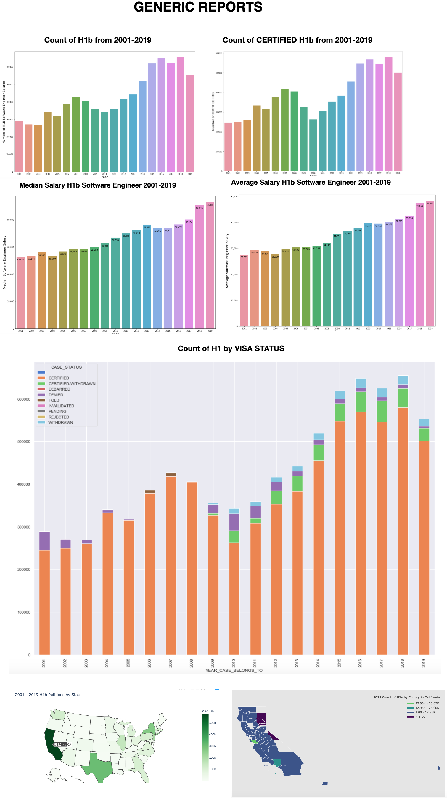
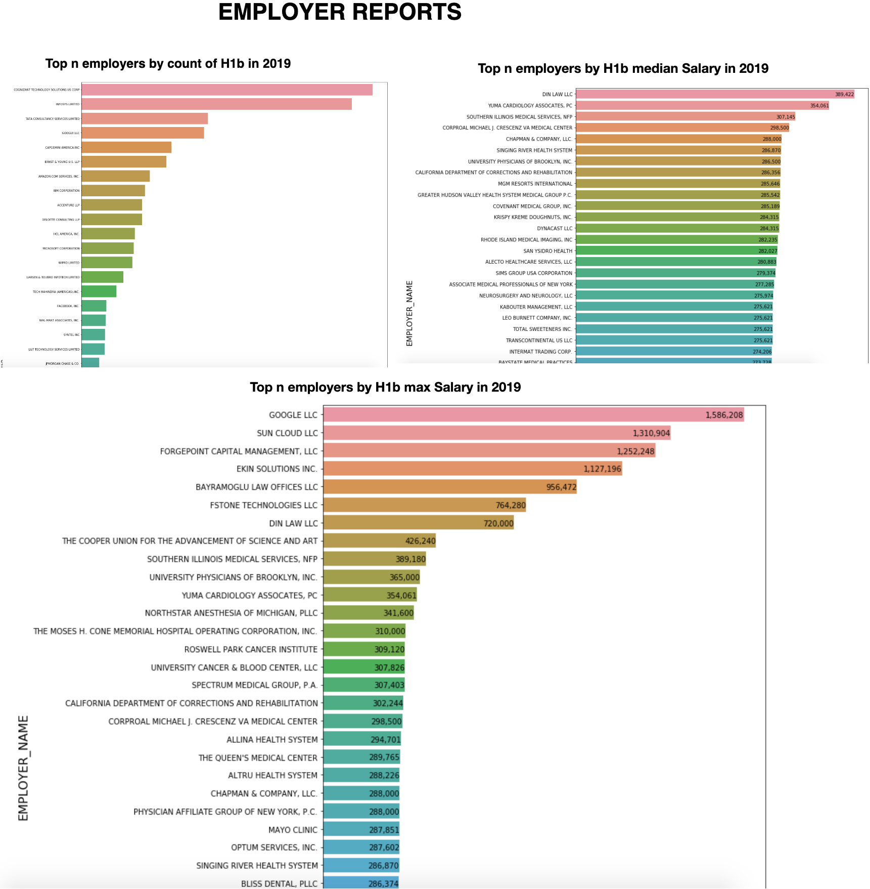
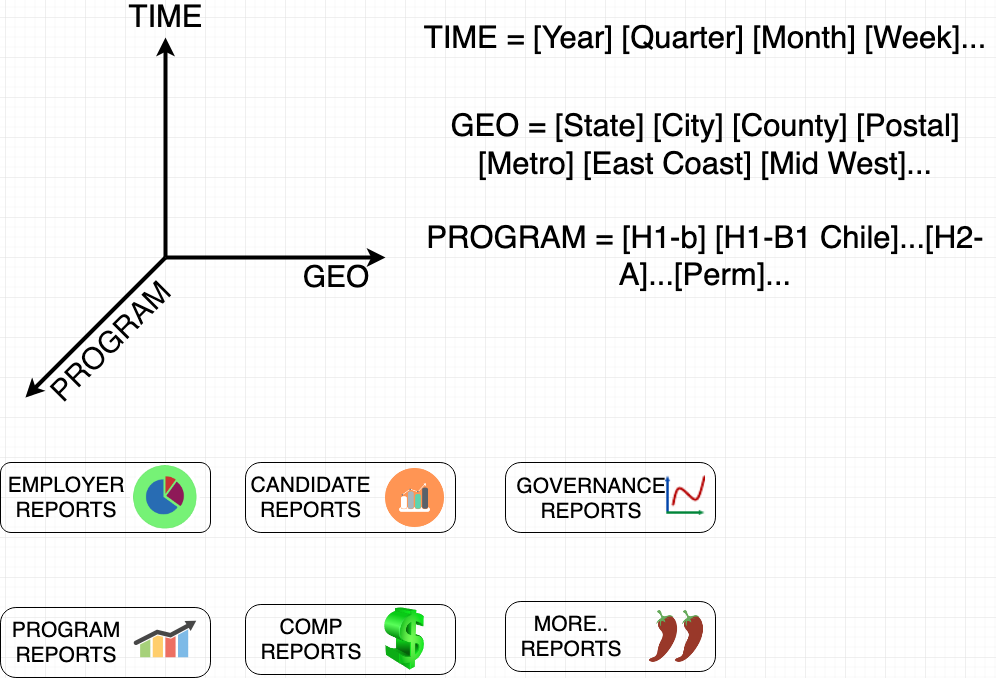

# Vision
Symmetric Labor MetricsR  is an innovative & intelligent platform that helps balance the interests and incentives of various roles in the labor market. 
[Read More](docs/vision.md)

# Data Credibility
We will start with publicly available data for e.g. [OFLC performance data](https://www.foreignlaborcert.doleta.gov/performancedata.cfm), join with other relevant data like SOC (standard occupational codes for jobs), FIPS (for geo county info) etc. The source of data is as credible as it can get straight from the horses mouth. 

# Reports
Below are images of the reports generated from this project. Explore the notebooks in `src/LCAProgramsH1BH1B1E3` for actual execution and generate reports, that you want to analyze data in detail. Granular data (for e.g. if you need top 100 employers data) is provided upon request. See section "How to contribute" to reach out, stating your reason on why you need granular data  

H1b Generic Reports             |  H1b Employer Reports
:------------------------------:|:------------------------:
  |  

# Value
Based on publicly available data , we can extract value out of the Programs and derive metrics/reports that affect decision making for [Entities, People, Government] etc.  
Some questions that help with actions for various roles
### Government

    - Which Visa program was effective ? How much effective in numbers ? Should we continue/discontinue/improve/make changes etc. ? 

    - Which geo (states, counties, cities, postal codes, metro areas etc.) are doing well/not well attracting immigration talent ? This has tax implications and we can correlate this with healthiness index, crime index, business index and many more

    - How did the visa program do since 2001 to date? What macro-economic factors might explain changes in visa programs over time trend ?

### People

    - Which geo should I look for jobs that pay a certain max. salary or above ? Which companies are visa sponsor friendly ?

    - Which companies have higher success rate for getting visa approved ?

    - How can I bargain with right data (mean, median, mode, standard deviation) for salaries and convince my future employer ? And have a fairer bargaining stance with data, instead of ONLY relying on my previous salary

### Entities

    If we need high talented engineers (for e.g.) or employees in larger numbers  - which program should I analyze that incentivizes in the right way to all parties involved ? 

    - Which geo should I set up my next branch of office, so that I have access to highly talented employees?

    - How are my competitors in the same industry doing when it comes to competing getting the best of the cream ?

    - How much salaries are my competitors paying to various job titles ? How can I have a fairer negotiation discussion with job seekers ?  

### Dimensions and Report Categories

# Roadmap
We will start our journey with LCA programs, however the list will keep getting updated. [Full Roadmap](docs/roadmap.md)  

# Gotchas
- No data has been uploaded to the repo, as data is BIG (or large enough)
- Genuine contributors will be provided access to the already cleaned and transformed LCA data (that I spent many months on)

# What do I need help with ?
- Static Data Visualization coding with Seaborn, plotly, pandas and ecosystem or any other library that you bring skills along with you. For now, all code will be written in jupyter notebooks ONLY. I will accept PR's only if it is jupyter notebook as it is easier to verify and go slow first, before taking a marathon. Data intensive projects like this one require precision and I do NOT want to rush with too much code and spend time debugging code, when the real value is actually in the data (and that can be achieved slowly with jupyter notebook step by step)
- Help create a data warehouse by splitting Gold Data into Dimensions and Facts using [LCA MASTER SCHEMA](docs/lca_master_schema.md). Ultimately, our data warehouse will incorporate all programs, once we solve 0 to 1 problem with LCA data.
- Dynamic Data Visualization using any of 
    - [Metabase](https://github.com/metabase/metabase)
    - [Superset](https://github.com/apache/incubator-superset)
    - [Smashing](https://github.com/Smashing/smashing)
    - [Keen Dashboard](https://github.com/keen/dashboards)
    - [Freeboard](https://github.com/Freeboard/freeboard) - mostly for streaming
    - [Mozaik](https://github.com/plouc/mozaik)
    - [Grafana](https://github.com/grafana/grafana) - Has the highest stars on github compared to the rest
    - [Redash](https://github.com/getredash/redash)  
But open to other open source tools. Because we want to ultimately publish to a web portal and have user interaction for e.g. being able to select a filter on the visual.
- Not high priority, however if you come with airflow experience, need help converting the data workflow notebooks into airflow DAGs -> Tasks. I say this is not high priority, because the incremental data gets published every quarter and automating it right away is NOT in the critical path (of visualizing reports and highest value)

# How to Contribute
- Write your jupyter notebook for various visualizations and submit PR (Ask [mailto](mailto:pradeep@automationpractice.com) for sample data set). You can see some examples in src/LCAProgramsH1BH1B1E3 folder
- For data warehouse tasks, we might need a deeper grooming session , so [mailto](mailto:pradeep@automationpractice.com) me and I will provide bootstrap material that you can go work with
- For Metabase, Superset or other dynamic visualization platforms, I will provide the server and data, you would have to learn the tool by *yourself* and create visualizations
