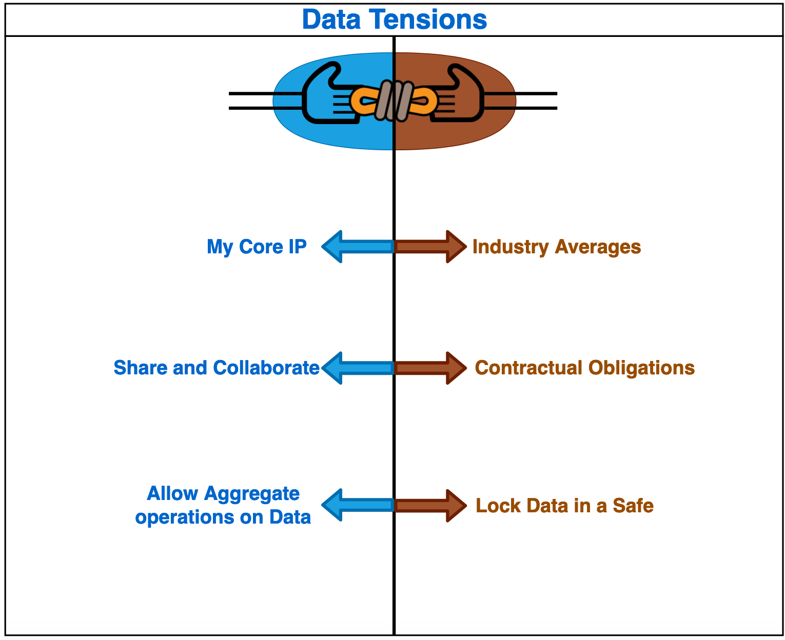
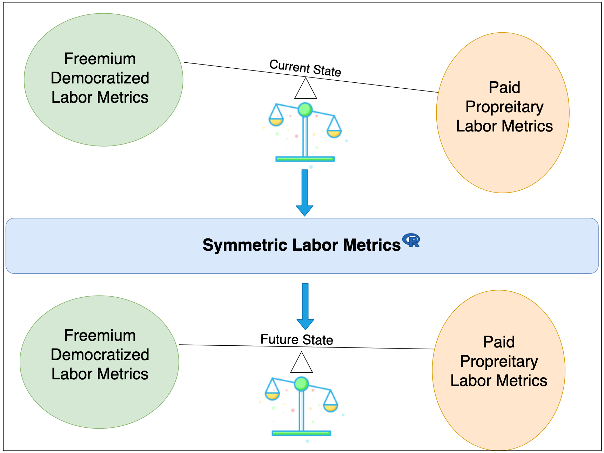

# Background & Context

Labor market dynamics is probably as fundamental concern for all of us much like eating, sleeping and other needs in life. Understanding labor market has significant implications in the areas of for e.g.

- Matching supply and demand of labor
- Identify supply and demand of  labor skills by geo location
- Readiness index “before” venturing into a new geo location - to ensure there is capacity to scale  

The roles involved in the labor market

- Employer/Company (who hires labor)
- People (the actual labor)
- Government (from governance and overall watchdog - ensuring fairness)

# Problem Statement

Few questions, answers to which have significant implications in labor market

    How much salary can I ask for the job ? - Job Seeker

    How much salary do I pay for the job ? - Employer 

    What is a “fair” salary for a job in the labor market ? - Government

The answer to each of the above questions "depends" on too many variables that move daily in the labor market (some affected by macro-economic movements like stock market, technology, GDP and others micro-economic like "scope", negotiation, public vs. private sector etc.)

    Like KBB (Kelly blue book) index for car prices in the US (free for certain high-level data and paid for granular data) - Is it possible to track labor metrics (by geo, by wage, by ..etc.)

# Is this an unsolvable problem ?

If we think about it, IF all the salary data across all employers in every country is aggregated in one place, data analysis is the easier part and given the big data technologies we have today, it is no longer a technical constraint to get us all answers and be able to publish a “salary index” much like stock price or any other indicators. The index itself might be “lagging” (i.e. it is based on regression analysis on historical data), or “leading” (apply data science to predict the value based given the list of values for all other variables or a subset of them).

### Trivia 
In this information age, raw data is the key differentiator giving competitive edge to the company that owns the data. Data intensive companies are valued higher, sustainable for longer term and frankly for-profit organizations are scrambling to collect as much data as they can to stay relevant. The “cloud revolution” with AWS, Azure, GCP - while on one hand is the next step in the digital evolution , on the other hand become exponentially valuable for each client that on boards to their environment, dropping in their data (think of Amazon S3, Azure BLOB etc.)

- But as we know NO entity (employer/company/organization) would prefer sharing data out there for analysis for social reasons, especially IF the data is its "core advantage", "competitive data" and so on. Ultimately "asymmetry of data" gives arbitrage opportunity and boosts profit - otherwise also referred to as IP (intellectual property)
- At the same time, an interesting fact is that every entity wants to know the data about  "external", so that they can react to threats and/or actions for survival. Keeping aside whether its right or wrong, that is how the world works (from philosophical angle) and we have to move on with that i.e. information asymmetry

# Data Tensions
  

The problem (democratized labor metrics) is solvable because we know that payroll companies have the salary data (ADP, Intuit, Workday etc.) for e.g. But   
- Will they really share the data ? They loose information advantage and/or violate fiduciary responsibility
- Are they allowed to share ? Each client owns the employee's salary data and client is data owner, and so contractual obligations do not let them share
- Do they have structured/unstructured data, that follows an industry standard 
- Is there an industry standard for payroll data schema ? This aspect of the problem is the easiest to solve from technology standpoint

# How do we find the sweet spot between 1 and 2 ?
- Is there a website/portal/organization that can give us the data ? There are organizations like Gartner/Nielsen etc. that host data-sets they collect from various sources, however they probably share ONLY aggregates , and granular level access to data might be through consulting service engagement.
- The labor market salary information (across the world) is so disintegrated and controversial, that no single organization owns it and keeps track of all data - which is democratically shared and viewed by the beneficiaries (Job seeker is a role that requires this data, to have a bargaining position)
- There are management consulting & knowledge building companies who in turn have huge data, and keep collecting more as they get engaged in consulting by clients , who venture into new geographies - and they take help from localized data-collection agencies. The data sets owned by such companies are probably rich , but unfortunately , yet again they are core IP (intellectual property) 
- Like KBB (Kelly blue book) index for car prices in the US (free for certain high-level data and paid for granular data) - Is it possible to track labor metrics (by geo, by wage, by ..etc.)?

# Symmetric Labor MetricsR - The Balancer

Symmetric Labor MetricsR  is an innovative & intelligent platform that helps balance the interests and incentives of various roles in the labor market. 
Our innovative and intelligent platform tracks data from various sources (public data) and private to give you comprehensive and well-informed labor metrics, so that you are confident 
- In decision making
- Support decisions with a data driven approach
- Help reconcile fairness of pay discussions  

